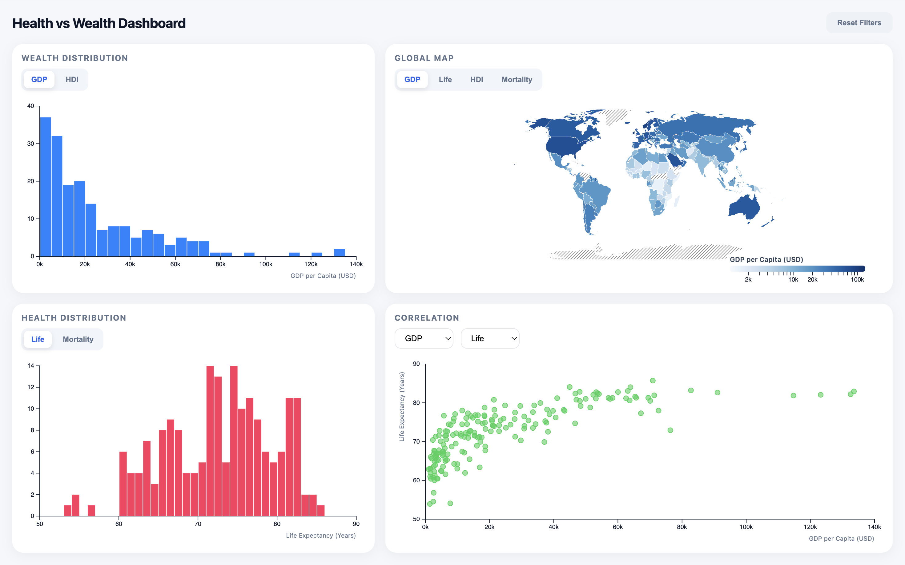
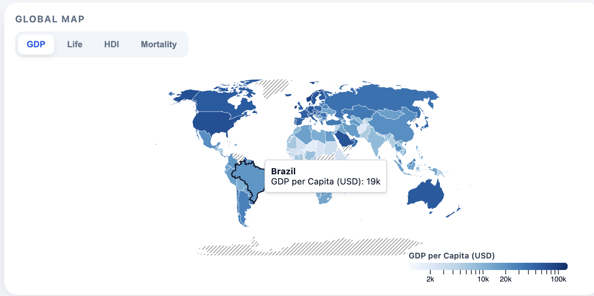
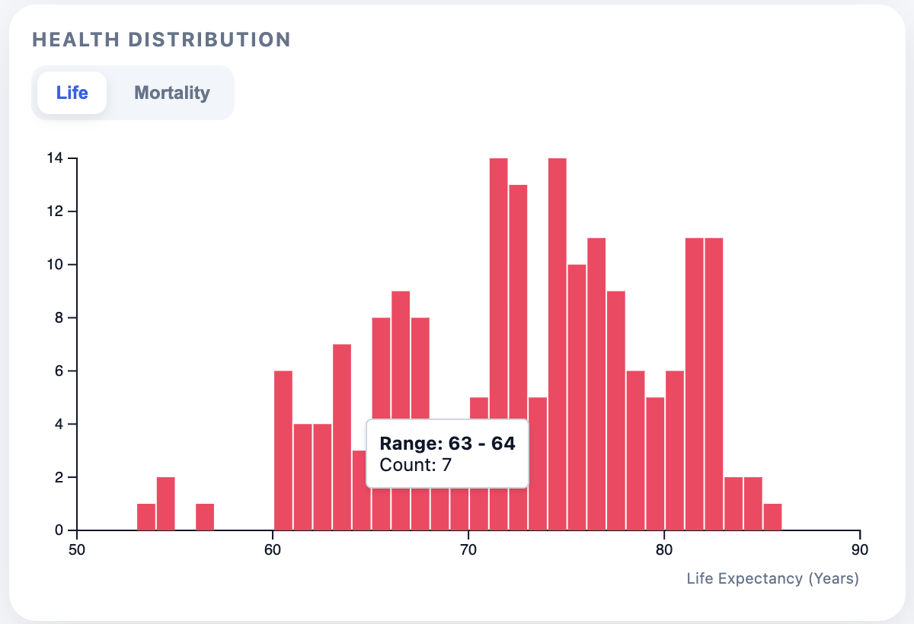
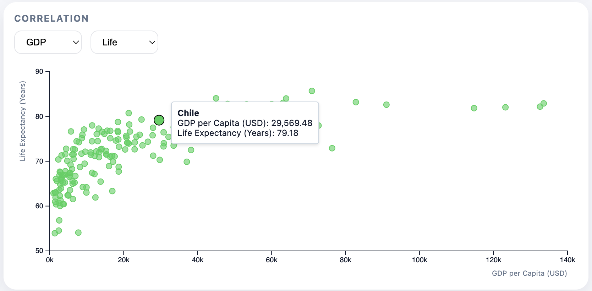
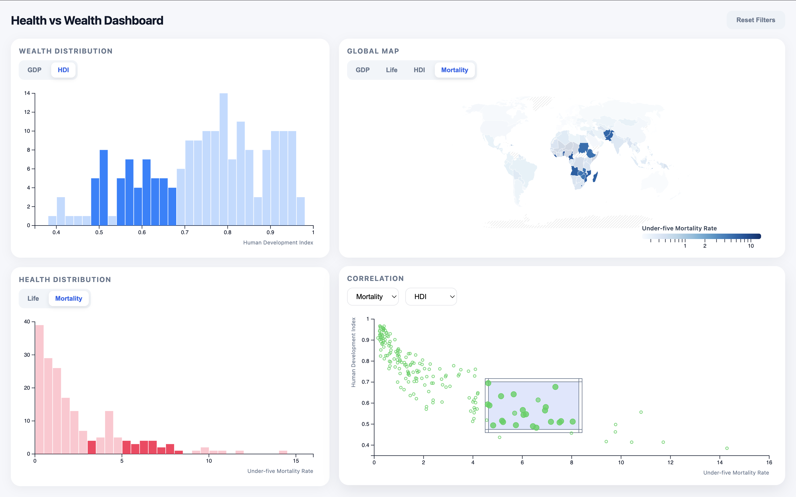
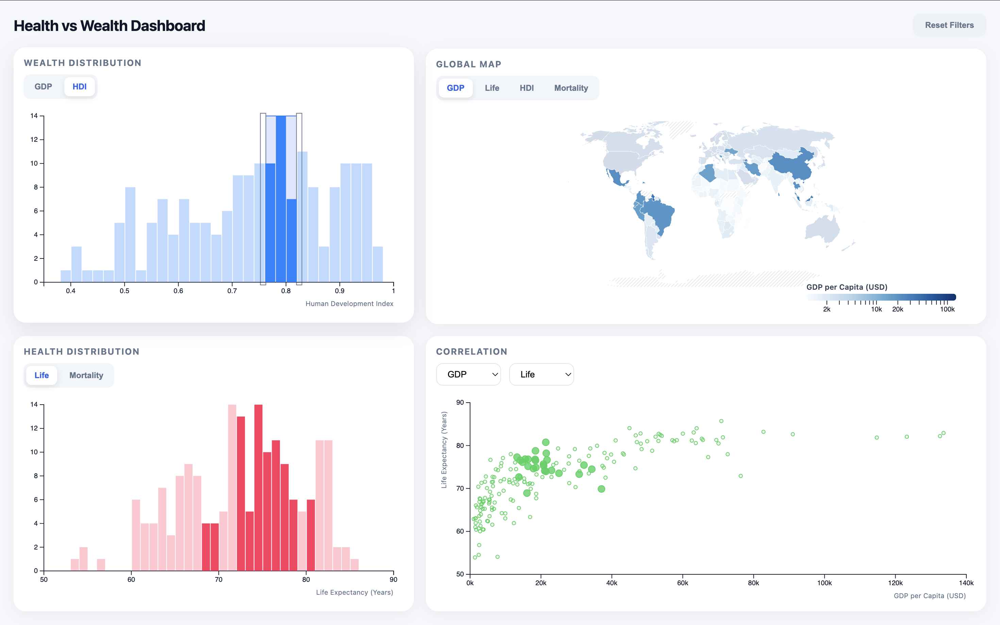
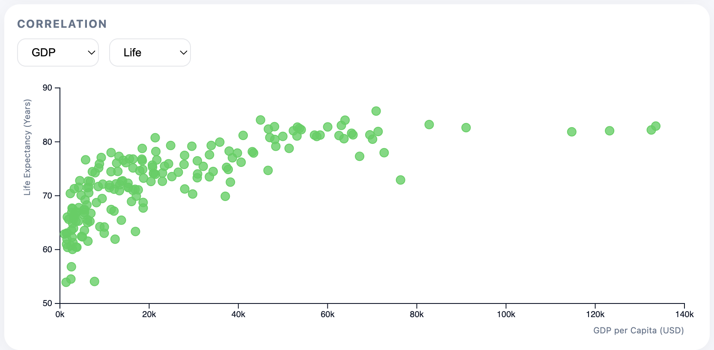
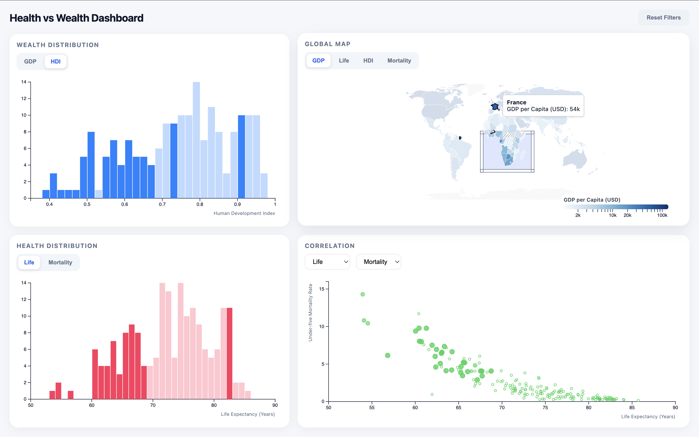
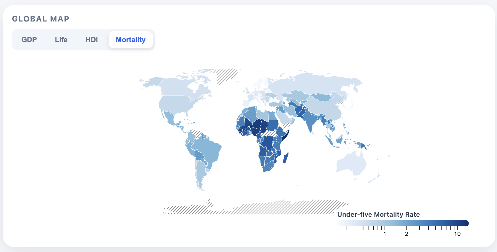

# Health vs. Wealth Dashboard

**By Kaleab Alemu** _February 2026_\
**Live App:** [Wealth vs Health Dashboard](https://wealth-health-vis.vercel.app/)

---

## Table of Contents

1. [Project Overview](#project-overview)
2. [The Data](#the-data)
3. [Visualizations & Interactivity](#visualizations--interactivity)
4. [Findings](#findings)
5. [Tech Stack & Code Structure](#tech-stack--code-structure)
6. [Challenges & Future Work](#challenges--future-work)
7. [AI Usage](#ai-usage)
8. [Demo Video](#demo-video)

---

## Project Overview

This dashboard visualizes the relationship between a nation's wealth and its public health outcomes. Rather than treating these metrics in isolation, it investigates whether economic prosperity actually translates into longer, healthier lives.

---

## The Data

**Source:** [Our World in Data](https://ourworldindata.org/search)

Four datasets were merged into a single master file covering **2022** data:

| Dataset                           | Description                                             |
| --------------------------------- | ------------------------------------------------------- |
| **Life Expectancy**               | Average years a newborn is expected to live             |
| **Child Mortality Rate**          | Under-five deaths per 1,000 live births                 |
| **GDP per Capita**                | Economic output per person (PPP-adjusted, World Bank)   |
| **Human Development Index (HDI)** | UN composite of health, education, and living standards |

**Processing (`preprocess.py`):** Raw CSVs were cleaned (dropping nulls and redundant columns), filtered to 2022, and joined via inner merges on `Entity` and `Code` (ISO-3). Only countries with complete data across all four indicators are included. The output is `level1_data.csv`.

---

## Visualizations & Interactivity

### Interface

The layout splits into a **Geographic Map** (left) and a **Visualization Stack** (right), allowing spatial and statistical views simultaneously. Controls are embedded within each panel.

### Views

**A. Global Choropleth Map** — Countries are color-coded by a selected metric using a continuous scale. Missing data regions display a striped pattern.

**B. Interactive Histograms** — Two histograms show the frequency distribution of GDP and Life Expectancy/Child Mortality, revealing global skews (e.g., many low-income vs. few high-income countries).

**C. Multivariable Scatterplot** — Plots any two of the four metrics against each other. Defaults to GDP (X) vs. Life Expectancy (Y), with dropdowns to re-assign axes.

### Interaction

All views are **coordinated**—a selection in one updates all others.

- **Brushing:** Draw a selection box over any chart to highlight matching countries across all views.
- **Linked Highlighting:** Selected data stays vibrant; unselected data fades to a low-opacity ghost.
- **Smooth Transitions:** Switching metrics triggers fluid D3 animations to help track relative country positions.
- **Hover Tooltips:** Hovering over any country or data point reveals all four metric values.

---

## Findings

### 1. The Logarithmic Wealth–Longevity Relationship

Wealth and life expectancy follow a **logarithmic curve**: early-stage economic growth yields large health gains (basic sanitation, immunization), but returns diminish significantly at higher income levels. Beyond a threshold, longevity is driven more by lifestyle, elderly care, and chronic disease management.

### 2. The "French Guiana" Anomaly

Brushing Sub-Saharan Africa unexpectedly highlighted France—because France's overseas territories (Mayotte, Réunion) sit off the African coast. Since the dashboard treats France as a single multi-polygon entity, its high European GDP was pulled into the African regional subset, skewing the histograms. This exposed the inherent complexity of mapping sovereign data onto geographic regions.

### 3. The Sub-Saharan Mortality Gap

Child mortality data reveals a persistent cluster of high rates in Sub-Saharan Africa that persists even when controlling for GDP. This suggests the gap is driven by systemic factors—limited clean water access, maternal healthcare, and infectious disease prevalence—beyond what economic growth alone can address.

---

## Tech Stack & Code Structure

| Technology            | Role                                              |
| --------------------- | ------------------------------------------------- |
| **D3.js (v7)**        | Data binding, projections, scales, brushing logic |
| **JavaScript (ES6+)** | Modular class-based component architecture        |
| **HTML5 / CSS3**      | Layout (Flexbox/Grid), CSS Variables for theming  |
| **Python (Pandas)**   | Data cleaning and multi-set merging pipeline      |

The project follows a **Class-Based Modular Pattern**:

- **`main.js`** — Entry point; manages global state and coordinates linked views via a `handleSelection` callback.
- **`choroplethMap.js`, `histogram.js`, `scatterplot.js`** — Self-contained view classes with internal resize and update logic.
- **`preprocess.py`** — Standalone data pipeline producing `level1_data.csv`.

---

## Challenges & Future Work

**Responsive Map Scaling** — Fitting the choropleth into a dynamic container without distorting the Natural Earth projection required careful use of `viewBox` attributes and resize listeners.

**Polygon Brushing** — Unlike point-based charts, countries are polygons. After evaluating full containment and centroid approaches, I chose **intersectional selection** (highlight if any boundary point falls within the brush), which best handles small island nations and coastal regions.

**Reflections** — A **Global Metric State Manager** would be the first thing I'd add in a rebuild, allowing a single selector to update the Map, Histograms, and Scatterplot simultaneously.

**Roadmap:**

- **Dynamic Zoom & Pan** (`d3-zoom`) — Auto-zoom the map when a cluster is brushed.
- **Predictive ML** — A regression model with a "hypothetical GDP" slider to forecast health outcomes.

---

## AI Usage

I used Gemini as a debugging aid for container overflow issues and D3.js SVG scaling to achieve a responsive layout.

---

## Demo Video

    <a href="https://www.loom.com/share/0119ecd6fb294488846f8552384a99d8">
      
Health vs Wealth Dashboard - 26 February 2026 - Watch Video

    </a>
    

